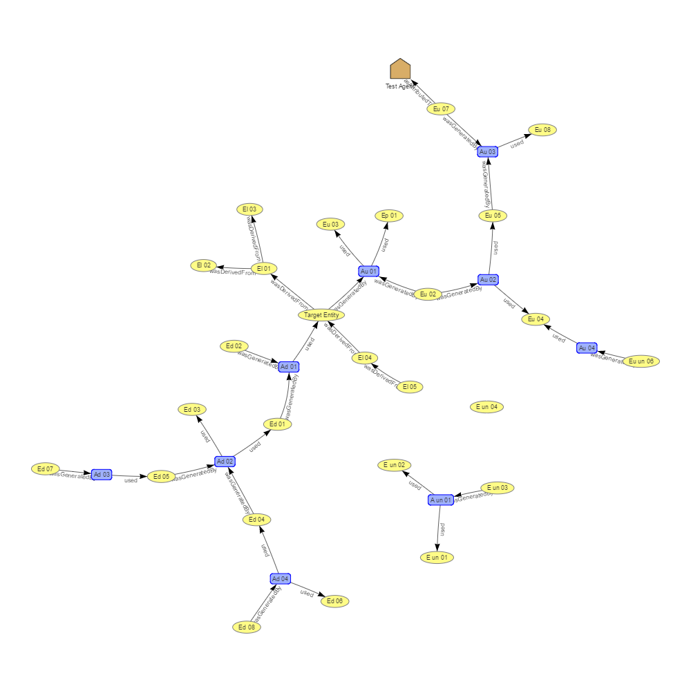

# PROV SVG

This small repository contains a tiny Python Flask project to render PROV ontology data as a nde and edge graph using Scalable Vector Graphics. The main toolkit used is the [vis.js](http://visjs.org/) JavaScript visualisation toolkit.

Here is an example of output using the file [test_prune_11.ttl](data/test_prune_11.ttl):

### Using this repository

### Software
This repository works with Python 3.6 and the packages listed in [requirements.txt](requirements.txt).
#### License 
This code is supplied under a Creative Commons 4.0 license. See [LICENSE](LICENSE) for the specifics.

#### Citation
If you would like to refer to this repository, please do so using the URI http://promsns.org/repo/prov-svg. A standard software repository citation might look like:

> Car, N.J. (2017) PROV SVG. Python 3.6 Flask code Repository using Git version control. Available online at http://promsns.org/repo/prov-svg, accessed yyyy-mm-dd.

### Author
**Nicholas Car**  
Geoscience Australia  
<nicholas.car@ga.gov.au>  
<http://orcid.org/0000-0002-8742-7730>
